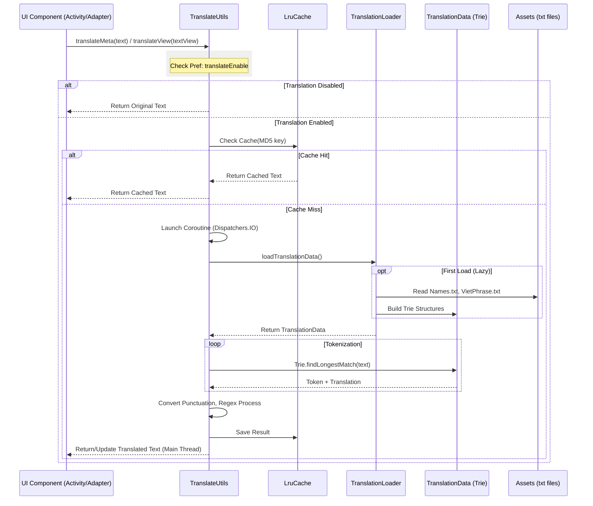

# Translation Feature Architecture

This document maps the control flow and data flow of the Chinese-to-Vietnamese translation feature in Legado.

## High-Level Flow (Mermaid)

## Component Breakdown

### 1. **Entry Points (`TranslateUtils.kt`)**
The integration points for the rest of the app:
*   `translateMeta(String)`: Suspend function for one-off string translation (e.g., Book Titles, Author names).
*   `translateContent(String)`: Suspend function for large text blocks (Chapter content).
*   `translateView(TextView, ...)`: Helper to handle async translation for list items (RecyclerVIew) to avoid lag/flicker. Handles tagging views with keys to prevent race conditions.

### 2. **Core Logic (`TranslateUtils.kt`)**
*   **Caching**: Uses `LruCache<String, String>` (10MB limit) keyed by MD5 hash of original text.
*   **Text Processing**:
    *   `convertPunctuation`: Maps Chinese punctuation (。，) to Vietnamese/English (. ,).
    *   `processText`: Regex post-processing for capitalization, multiple space trimming, and quote normalization.

### 3. **Data Loading (`TranslationLoader.kt`)**
*   **Singleton/Lazy**: Data is loaded only when the first translation request occurs.
*   **Asset Parsing**: Reads `Names.txt` and `VietPhrase.txt` from `assets/translate/vietphrase/`.
*   **Memory Management**: Holds the `TranslationData` in memory. `clear()` can be called to release memory.

### 4. **Data Structure (`TranslationData.kt` / `Trie`)**
*   **TranslationData**: Holds the instances of `Trie` for Names and VietPhrase, and a Map for PhienAm.
*   **Trie**: A prefix tree structure for efficient "Longest Matching Prefix" search.
    *   *Optimization Note*: Currently uses `mutableMapOf<Char, TrieNode>`. Can be optimized to `SparseArray` for memory efficiency.
