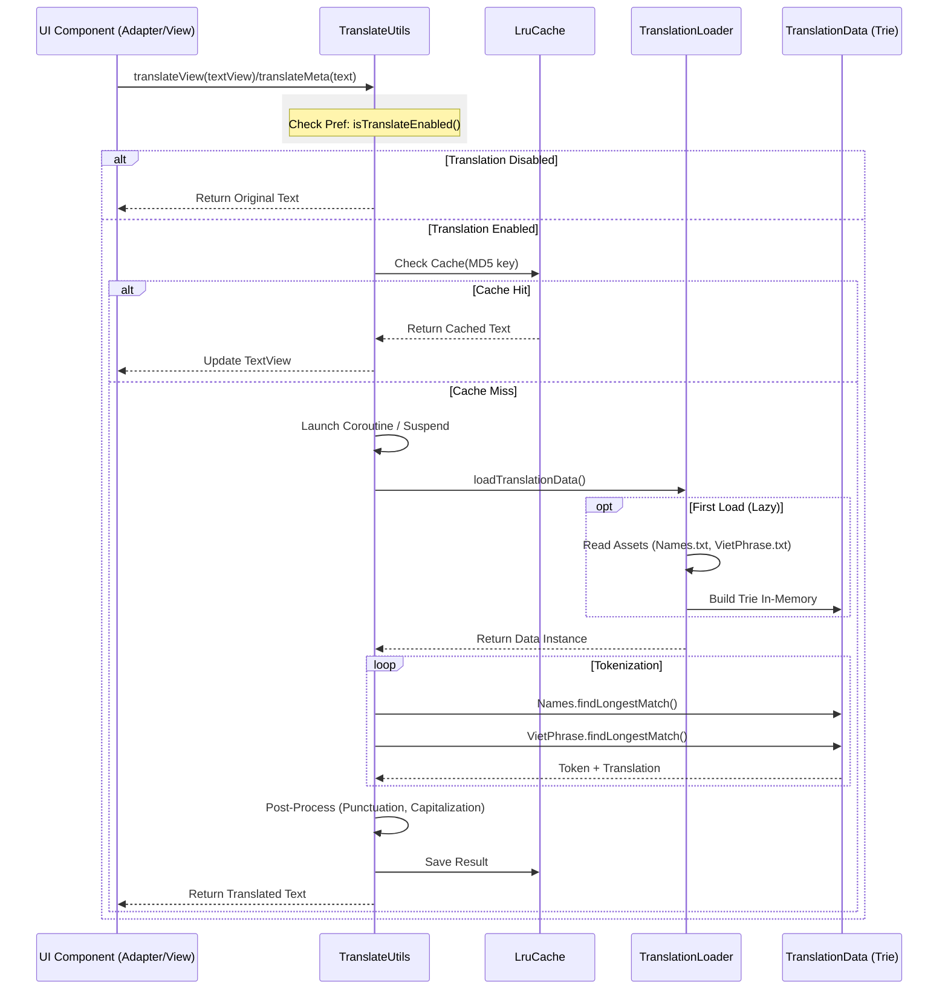
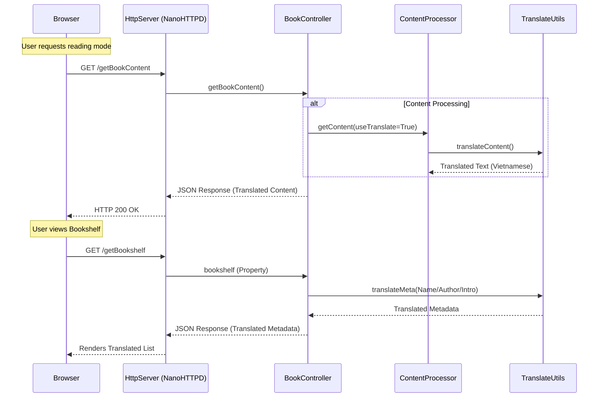

# Translation Feature Architecture

This document maps the control flow and data flow of the Chinese-to-Vietnamese translation feature in Legado.

## 1. High-Level Flow (App UI)

## 2. Web Service Integration Flow

The Web Service (accessible via Browser) reuses the core translation logic but bypasses the App UI layer.

## 3. Dictionary Management & Reloading

Custom dictionaries allow users to override or extend standard translations.

*   **Files**: Stored in `primary/Legado/dict/` (e.g., `Names.txt`, `VietPhrase.txt`).
*   **Import**: `DictManageActivity` handles file selection and copies content to the app's internal storage or merges with assets.
*   **Reload Mechanism**:
    1.  User imports/deletes a dictionary file.
    2.  `DictManager` updates the file system.
    3.  `TranslationLoader.reloadType(type)` is triggered.
    4.  `TranslationLoader` clears the static `translationData` instance and invalidates `LruCache`.
    5.  Next translation request triggers a fresh load from disk/assets, incorporating new entries.

## 4. Core Components

### `TranslateUtils.kt` (The Brain)
*   **Role**: Facade for all translation operations.
*   **Key Functions**:
    *   `performTranslation(text)`: The main algo (Tokenize -> Match -> Reassemble).
    *   `translateMeta(text)`: Optimized for short strings (Titles, Names).
    *   `translateContent(text)`: Optimized for long texts (Chapters).
    *   `translateView(TextView)`: Extension for Android Views.

### `TranslationLoader.kt` (The Builder)
*   **Role**: Configures and loads dictionary data into memory.
*   **Strategy**: **In-Memory Trie**.
    *   Previously attempted SQLite (binary) but reverted due to complexity/performance issues.
    *   Current uses optimized `Trie` class for rapid prefix matching.
*   **Data Sources**:
    1.  `assets/translate/vietphrase/` (Built-in)
    2.  User custom files (Overlays)

### `TranslationData.kt` (The Container)
*   **Structure**:
    *   `Names`: Trie (Highest Priority)
    *   `VietPhrase`: Trie (Medium Priority)
    *   `ChinesePhienAm`: HashMap (Fallback for unknown characters)

### `ContentProcessor.kt` (The Hook)
*   **Role**: Prepares book content for display.
*   **Integration**: Calls `TranslateUtils` immediately after loading raw content and applying replacement rules, ensuring all downstream consumers (App Reader, Web Service, TTS) receive translated text.

### `BookController.kt` (Web API)
*   **Role**: Handles HTTP API requests.
*   **Integration**: Manually injects `TranslateUtils` calls for metadata fields (Name, Author, Title) before serializing JSON responses, bridging the gap between raw DB data and user expectation.
